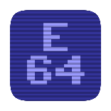

# E64-ROM

This source code forms part of the E64 virtual computer system.



## Compiling

Install the ```vasmm68k_mot``` assembler, the ```vlink``` linker and the ```vbccm68ks``` compiler. A standard ```<make>``` command will produce a 64k ```rom.bin``` file as well as the ```rom.cpp``` source file that forms part of ```E64```.

## Coding Style

### Calling Conventions

The standard C m68k calling convention is the way to go:

* ``D0``, ``D1``, ``A0`` and ``A1`` are scratch registers
* All other registers are callee saved / restored
* ``A5`` is the frame pointer
* Parameters are pushed onto the stack, from right to left
* Return value is stored in ``D0``
* Responsibility of the callee is to save and restore all other registers that it uses

Scratch registers mean that the caller is aware that the contents are not necessarily the same upon return. So the caller must save and restore these registers if they are to be kept.

## Websites and Projects of Interest

* [E64](https://github.com/elmerucr/E64) - E64 virtual computer system inspired by the Commodore 64, Amiga 500 and Atari ST.
* [Moira](https://github.com/dirkwhoffmann/Moira) - Motorola 68000 cpu emulator written in C++ by Dirk W. Hoffmann.
* [reSID](http://www.zimmers.net/anonftp/pub/cbm/crossplatform/emulators/resid/index.html) - ReSID is a Commodore 6581 or 8580 Sound Interface Device emulator by Dag Lem.
* [SDL Simple DirectMedia Layer](https://www.libsdl.org) - A cross-platform development library by Sam Lantinga designed to provide low level access to audio, keyboard, mouse, joystick, and graphics hardware.
* [stb](https://github.com/nothings/stb) - single-file public domain (or MIT licensed) libraries for C/C++
* [vAmiga](https://dirkwhoffmann.github.io/vAmiga/) - An Amiga 500, 1000, or 2000 on your Apple Macintosh by Dirk W. Hoffmann.
* [vasm assembler](http://sun.hasenbraten.de/vasm/) - A portable and retargetable assembler.
* [vbcc portable ISO C compiler](http://www.compilers.de/vbcc.html) - vbcc is a highly optimizing portable and retargetable ISO C compiler. It supports ISO C according to ISO/IEC 9899:1989 and most of ISO/IEC 9899:1999 (C99).
* [VirtualC64](https://dirkwhoffmann.github.io/virtualc64/) - A Commodore 64 on your Apple Macintosh by Dirk W. Hoffmann.
* [vlink linker](http://www.compilers.de/vlink.html) - vlink is a versatile linker (written by Frank Wille)

## MIT License

Copyright (c) 2022 elmerucr

Permission is hereby granted, free of charge, to any person obtaining a copy of this software and associated documentation files (the "Software"), to deal in the Software without restriction, including without limitation the rights to use, copy, modify, merge, publish, distribute, sublicense, and/or sell copies of the Software, and to permit persons to whom the Software is furnished to do so, subject to the following conditions:

The above copyright notice and this permission notice shall be included in all copies or substantial portions of the Software.

THE SOFTWARE IS PROVIDED "AS IS", WITHOUT WARRANTY OF ANY KIND, EXPRESS OR IMPLIED, INCLUDING BUT NOT LIMITED TO THE WARRANTIES OF MERCHANTABILITY, FITNESS FOR A PARTICULAR PURPOSE AND NONINFRINGEMENT. IN NO EVENT SHALL THE AUTHORS OR COPYRIGHT HOLDERS BE LIABLE FOR ANY CLAIM, DAMAGES OR OTHER LIABILITY, WHETHER IN AN ACTION OF CONTRACT, TORT OR OTHERWISE, ARISING FROM, OUT OF OR IN CONNECTION WITH THE SOFTWARE OR THE USE OR OTHER DEALINGS IN THE
SOFTWARE.
